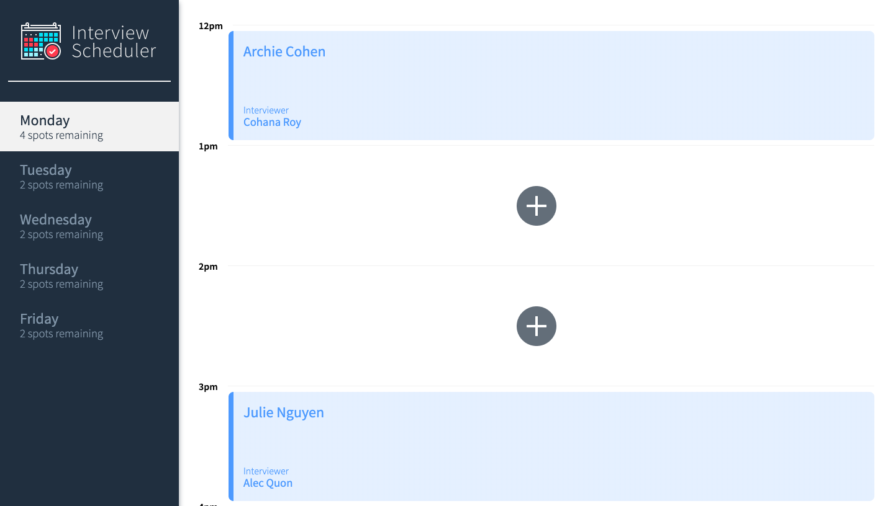

# Interview Scheduler
## About
This is a one page application for scheduling interviews 🎉. Using React as well multiple testing frameworks has brought this project to life, creating an effortless, easy-to-use interface. Follow the setup guide to try it out for yourself! 😊

## Sneak Peek


## Setup

🚨 Install dependencies with `npm install`.

## Running Webpack Development Server

```sh
npm start
```

## Running Jest Test Framework

```sh
npm test
```

## Running Storybook Visual Testbed

```sh
npm run storybook
```
